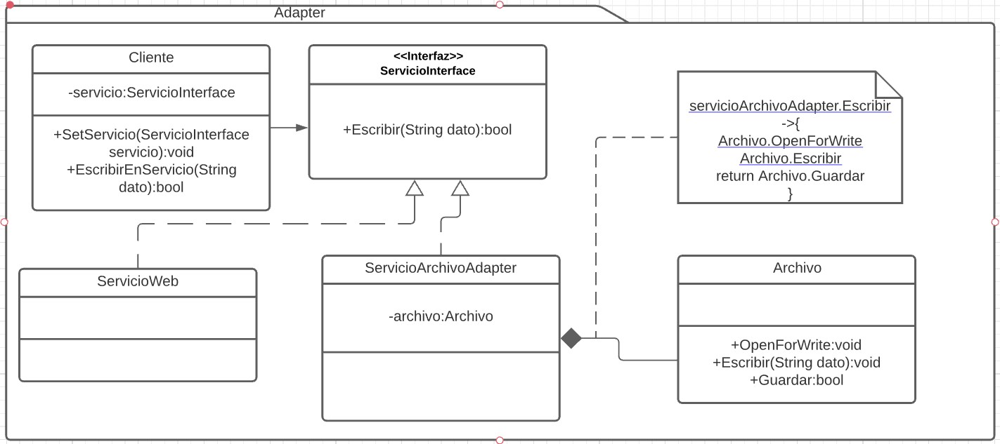

# Adapter
Es un patrón estructural. [Link descripción](https://sourcemaking.com/design_patterns/adapter)

El objetivo de un adapter es proveer a una clase cliente de una interfaz conocida con una implementación de la interfaz que "envuelva" la funcionalidad de una clase para la que el cliente no esta preparado para usar, de esta forma la clase "adaptador" implementa la interfaz conocida y realiza las operaciones necesarias para que el cliente pueda interactuar con la clase desconocida.

## Diagrama de clases

## SOLID

* Single responsability

Un adapter tiene una sola responsabilidad, la de convertir las llamadas de la interfaz hacia las llamadas de la clase cliente.

* Open/Close principle

Si se necesita nueva funcionalidad entonces puede perfectamente extenderse un adapter o crear uno nuevo que implemente la interfaz conocida por el cliente y de esta manera extender la funcionalidad original.

* Liskov substitution principle

Cualquier implementación de la interfaz conocida por el cliente debe comportarse correctamente, no hay razón para creer que este principio se rompa por el uso del patrón.

* Interface segregation

Adapter se acopla bien al uso de este principio ya que las interfaces deberían ser reducidas a un tipo de operación (una sola responsabilidad), si observamos que se está incumpliendo probablemente sea en la definición de la interfaz raiz del arbol de herencia y necesitemos refactorizar esa interfaz.

* Dependency inversión

El cliente debería esperar una interfaz, no una clase concreta, por lo que este principio se cumple. La clase adaptador debe estar bien diseñada y probablemente hacer uso de dependency inversión para que se cumpla completamente este principio.